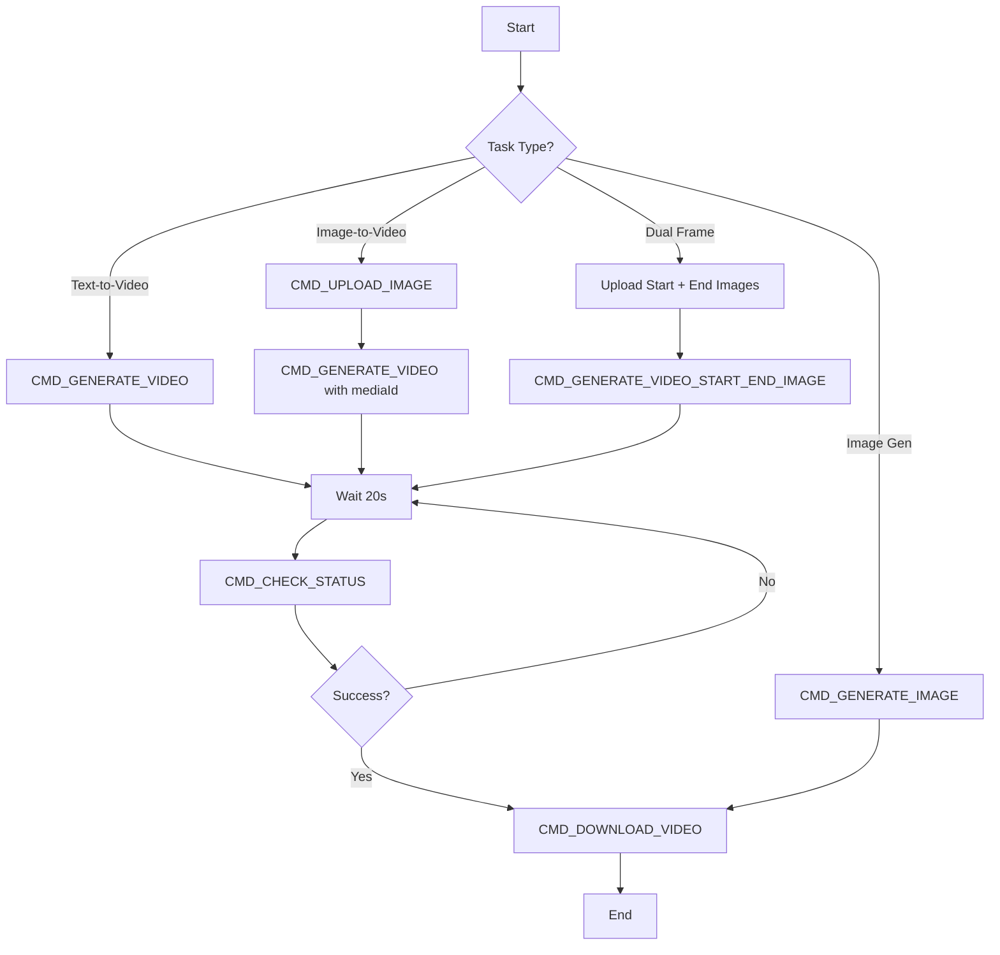

# VEO API Commands

Authentication: Bearer token, ProjectID, SessionID required.

---

## Setup Commands

**`SET_MODEL`**
- Input: `model_key` (e.g., `veo_3_1_t2v_fast`)
- Function: Selects AI model architecture

**`SET_ASPECT_RATIO`**
- Input: `ratio_enum` (`VIDEO_ASPECT_RATIO_LANDSCAPE` | `PORTRAIT`)
- Function: Defines output dimensions (16:9 vs 9:16)

**`GENERATE_SCENE_ID`**
- Output: UUID string
- Function: Creates unique tracking ID for asset

---

## Action Commands

**`CMD_UPLOAD_IMAGE`**
- Endpoint: `/v1:uploadUserImage`
- Method: POST
- Payload:
  ```json
  {
    "imageInput": {
      "rawImageBytes": "BASE64_JPEG_STRING",
      "mimeType": "image/jpeg",
      "isUserUploaded": true,
      "aspectRatio": "IMAGE_ASPECT_RATIO_PORTRAIT"
    },
    "clientContext": {"tool": "ASSET_MANAGER"}
  }
  ```
- Returns: `mediaGenerationId` (synchronous)
- **Requirements**: JPEG format, Base64 encoded (starts with `/9j/`)

**`CMD_GENERATE_VIDEO`**
- Endpoint: `/video:batchAsyncGenerateVideoText`
- Method: POST (Async)
- Payload: Prompt, Model Key, Scene ID
- Returns: Operation ID (status=PENDING)

**`CMD_GENERATE_VIDEO_START_END_IMAGE`**
- Endpoint: `/v1/video:batchAsyncGenerateVideoStartAndEndImage`
- Method: POST (Async)
- Model: `veo_3_1_i2v_s_fast_fl_ultra_relaxed`
- Payload: Prompt, Start Image ID, End Image ID, Scene ID
- Returns: Operation ID

**`CMD_GENERATE_GIF`**
- Endpoint: `/v1/video:generatePinholeGif`
- Method: POST (Sync)
- Payload: `mediaGenerationId`
- Returns: Base64 encoded GIF

**`CMD_GENERATE_IMAGE`**
- Endpoint: `/flowMedia:batchGenerateImages`
- Method: POST (Sync)
- Payload: Source Image ID (for upscale), Prompt
- Returns: URL immediately

---

## Query Commands

**`CMD_CHECK_STATUS`**
- Endpoint: `/video:batchCheckAsyncVideoGenerationStatus`
- Method: POST
- Payload: Operation Name (from generate response)
- Returns: `MEDIA_GENERATION_STATUS_WORKING` | `MEDIA_GENERATION_STATUS_SUCCESSFUL`

---

## Retrieval Commands

**`CMD_DOWNLOAD_VIDEO`**
- Source: Signed URL (from status check response)
- Method: GET
- **Headers**: REQUIRED `x-browser-*` headers
- Action: Stream `video/mp4` to disk

---

## Execution Flow



---

## Model Keys

| UI Name | Internal Key |
|---------|--------------|
| **Text-to-Video** | |
| Veo 3.1 - Fast (Landscape) | `veo_3_1_t2v_fast_landscape_ultra` |
| Veo 3.1 - Fast (Portrait) | `veo_3_1_t2v_fast_portrait` |
| **Image-to-Video** | |
| Veo 3.1 - First Frame | `veo_3_1_i2v_s_fast_ultra_relaxed` |
| Veo 3.1 - First + Last Frame | `veo_3_1_i2v_s_fast_fl_ultra_relaxed` |
| **Reference-to-Video** | |
| Veo 3.1 - R2V (Multi-image) | `veo_3_1_r2v_fast_landscape_ultra` |
| **Upscale** | |
| 1080p Upsampler | `veo_3_1_upsampler_1080p` |
| 4K Upsampler | `veo_3_1_upsampler_4k` |

---

## Image Upload Requirements

1. Convert to JPEG, Base64 encode
2. Calculate aspect ratio:
   - `w > h`: `IMAGE_ASPECT_RATIO_LANDSCAPE`
   - `h > w`: `IMAGE_ASPECT_RATIO_PORTRAIT`
   - `w == h`: `IMAGE_ASPECT_RATIO_SQUARE`
3. Extract `mediaGenerationId` from response
4. Use ID in video generation call
